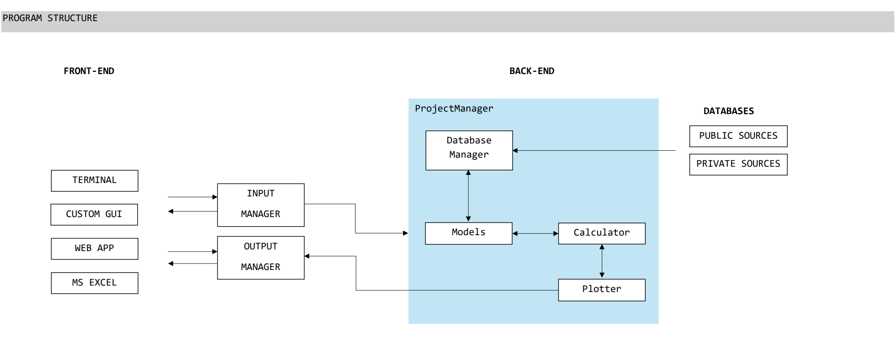
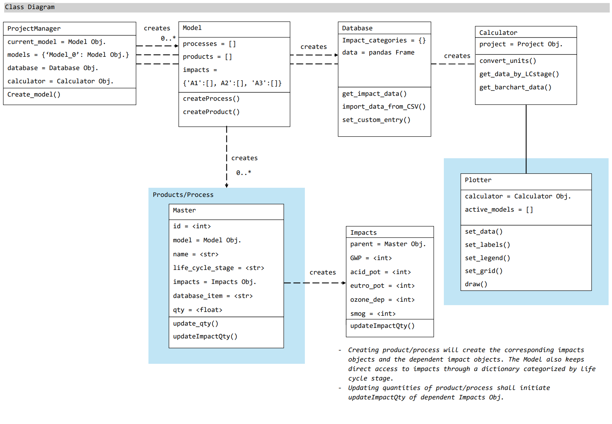
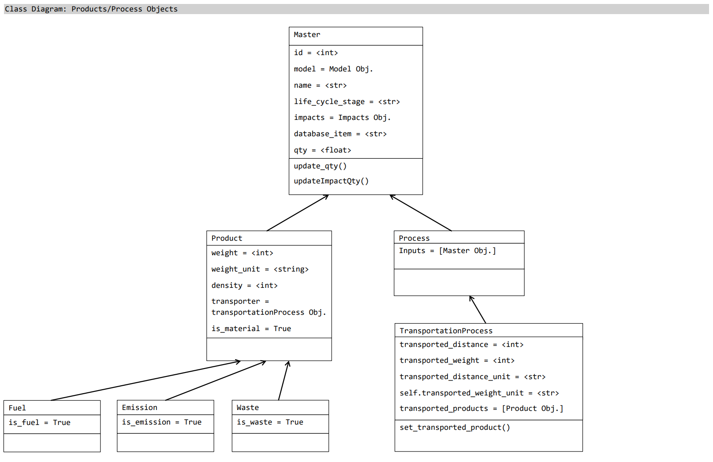
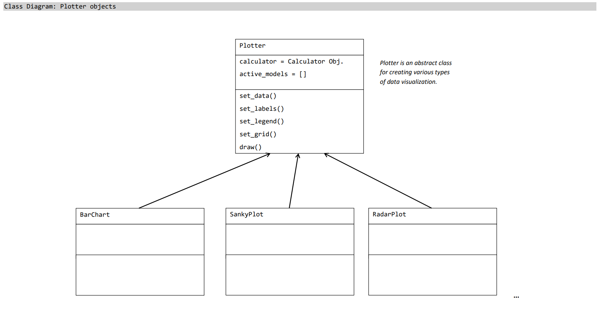

***************
Developer Guide
***************

The program structure of the code base is as below. The program is structured in such a way that it is independent of the front-end and the background database.

The class structure if the code base is as below.

:class:`Product <model.product.Product>` and :class:`Processe <model.process.Process>`  objects inherit from the :class:`Master class <model.master.Master>`. 

:class:`Plotter <visualizer.plotter.Plotter>` provide an abstract class to create visualizations.

:class:`Calculator <calculator.Calculator>` is the place to add new computation methods to reorganize (or work with) the impact data from the :class:`Models <model.model.Model>`.

`test_unittest` file includes a series of unit-tests to verify the new additions to the code base are compatible with the existing code implementations.

